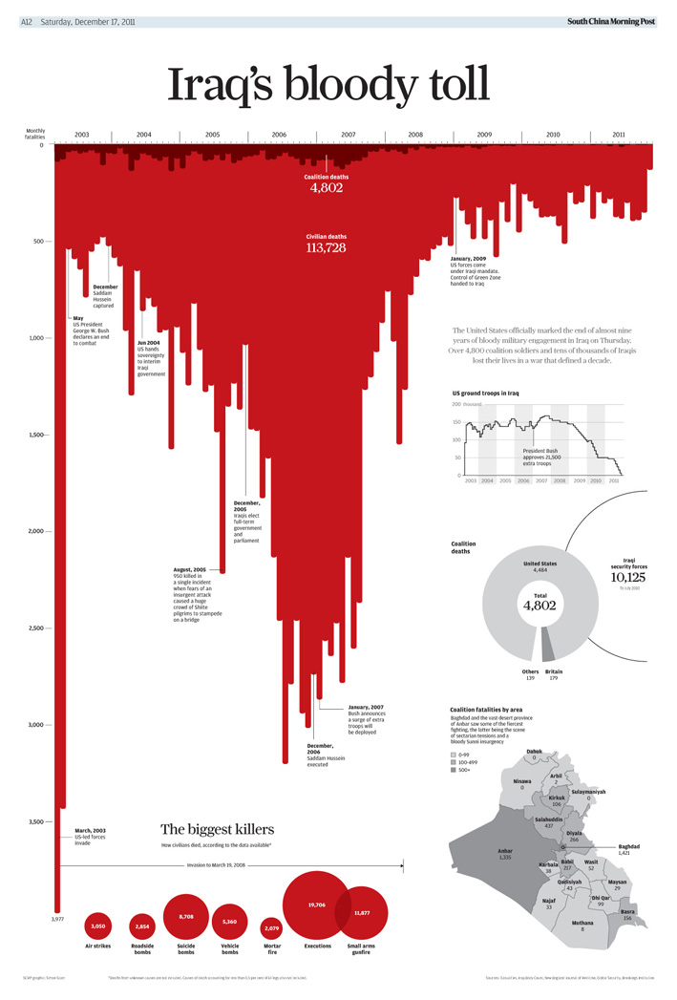
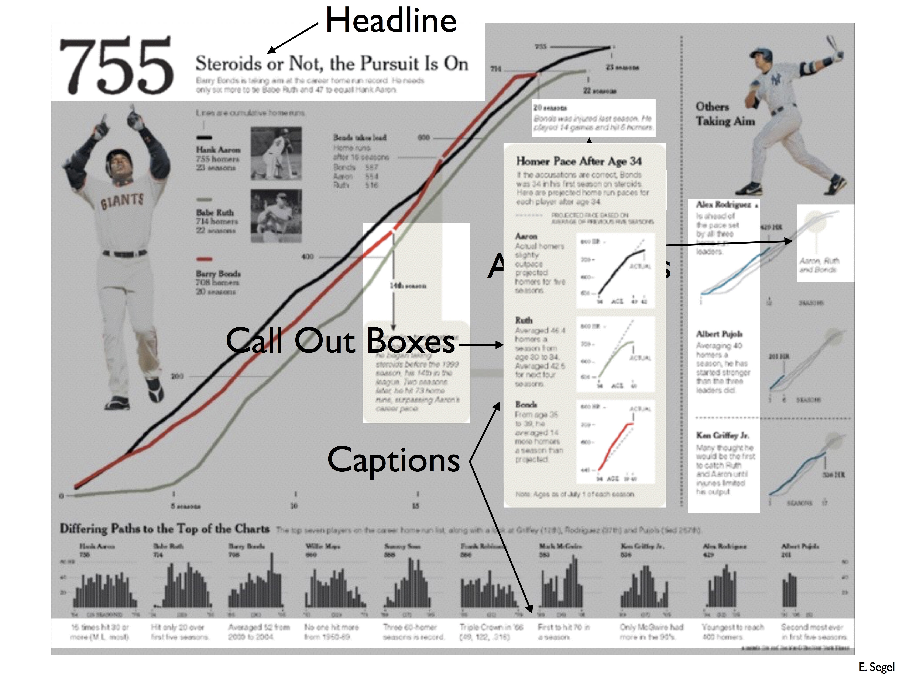

# 用数据讲故事
人类喜欢听故事，这个道理不仅适用于小孩，也适用于成年人。在数据可视化层面，能用数据讲故事这点非常重要，故事可以帮助你牢牢地抓住观众的注意力以达到你的目标。

比较笼统地讲，故事一般有下面这四个结构：

1. 人物出场（介绍有趣的发现）：很久很久以前，公主来到了一个村庄；
2. 遇到矛盾（你的发现遇到困境、矛盾）：公主被妖怪掳走了；
3. 解决矛盾（困境的解决、结论）：王子杀死了妖怪，解救了公主；
4. 保留想象空间（研究的局限性和未来工作）：最后王子和公主幸福地生活在一起。

好的数据故事精确对应目标观众、打动人心、解答问题、精心设计并让我们愿意做出改变，本篇笔记将说明如何用数据讲好故事。

## 确定目标和观众
在开始准备你的数据故事前，有两个关键问题需要明确：**你的目标是什么？你的观众是谁？**

确定你的目标。你的数据是要预测未来？还是理解当下的现象？检验你的假设？呼吁观众行动？

了解你的观众。你的观众是谁？观众有多少知识储备？他们听你演讲的动机是什么？他们想要什么？你的哪些目标和观众是一致的？你有哪些洞察可以分享给观众？

## 不要让观众思考
你的观众通常和你没有啥利益关系，也没有你的经历和体会，所以观众也懒得为了你的作品动脑子。所以切记这几个要点：

1. 用顺畅的逻辑贯穿你的故事；
2. 到了重要步骤提醒观众，注意，我们讲到这里了，现在开始下一部分；
3. 有趣的洞察要强调、划重点！
4. 图表的标题一定要**大**、**显眼**、体现主要信息。

## 出乎意料的洞察
用出于意料的洞察来抓住观众的注意力，「你可能觉得杜蕾斯是最好用的，但我们的数据发现冈本才是」。当意识到自己不知道某些事情后，观众的好奇心就被勾起，帮助你不尴尬地讲完故事。

## 包装
包装（包括设计、颜色、声音）像雕虫小技，但能帮助你引导观众。例如下面这张对伊战伤亡人数的统计，作者巧妙地把柱状图翻转并且使用鲜红色，使得图表像滴落的血迹，传达了作者的反战情绪，也引导观众思考士兵的生命。

如果用不一样的包装，这张图传达的信息就完全不一样了。

## 视觉设计
通常人的阅读顺序是从上到下、从左到右的，你的数据故事要对应观众的阅读顺序。

用注释、旁白格（call out box）体现图表的细节。

## 深入阅读
[让创意更有黏性](https://book.douban.com/subject/25813579/)  
[沟通：用故事产生共鸣](https://book.douban.com/subject/23018929/)  
[演说之禅](https://book.douban.com/subject/24381654/)  
[不只是美](https://book.douban.com/subject/26289656/)

## 作业
[Lecture Video: Story Telling and Effective Communication](https://matterhorn.dce.harvard.edu/engage/player/watch.html?id=697ce8bd-a41c-45d4-8201-5e0dcc8a518c)  
[CS109 Homework: More Exploratory Data Analysis](https://github.com/cs109/2014/blob/master/homework/HW2.ipynb)

## 致谢
数据科学导论笔记基于加州大学伯克利校区 [DS100](http://www.ds100.org/sp17/syllabus) 与哈佛大学 [CS109](http://cs109.github.io/2015/pages/videos.html) 的课程主页改写，参考了课件、笔记、阅读材料及作业，感谢制作这两门课程的 Joe Blitzstein、Hanspeter Pfister、Verena Kaynig-Fittkau、Joseph E. Gonzalez、Joseph Hellerstein、Deborah Nolan 和 Bin Yu。本文基于 CS 109 的 Lecture 6: Story Telling and Effective Communication。
