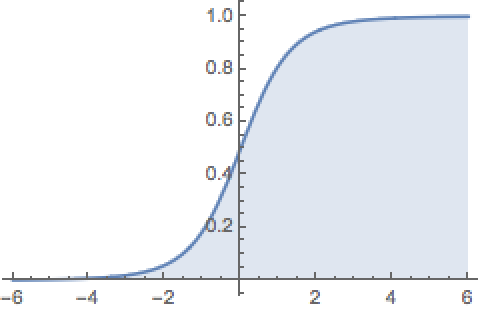

# 统计模型
这篇我们讨论统计模型，那么到底什么是统计模型？统计模型是一系列简化事实的分布。

为什么我们需要简化事实？以地图为例，如果地图越来越精细、越来越大，以至于它可以 1:1 地刻画现实世界，这张地图还有用吗？我们需要简化事实的模型帮助我们从复杂的数据里得到有用的信息，所谓[数据越多模型越不重要](https://scensci.wordpress.com/2012/12/14/big-data-or-pig-data/)的说法非常可笑，而许多媒体（例如连线）还深深相信这是事实。

正如 George Box 所言，所有模型都是错的，但有些模型有用。

> All models are wrong, but some models are useful.    

## 参数模型与非参数模型
什么是参数？假如有一个函数 f(x) = ax + b，a、b 不是自变量，我们需要给定 a、b 的值才能计算函数 f(x)，这里的 a、b 就是参数。在统计中，f(x) = ax + b 是我们选择的模型，a、b 参数通常是未知的，需要用样本分布的参数（estimator）估计（estimate）人口分布的参数（estimand）。

我们把统计模型分为两类，参数模型与非参数模型。参数模型（例如正态分布、二项分布）需要有限个的参数（例如均值、方差），非参数模型（例如 Bootstrap）需要无限个参数。这个分法不完全绝对，像半参数模型是把无限个的参数和有限个的参数分离来研究。

常理说参数越多、假设越少、适用范围更广，但记住「没有免费的午餐（No Free Lunch）」！这个定理告诉我们，不存在万能的模型（就像深度学习不一定可以解决一切机器学习的问题），具体情况需要具体分析，在使用统计模型前，一定要对数据进行探索性数据分析再套模型，如果效果不佳，再继续尝试，数据科学是不断往复尝试（iterative）的过程。

## 概率密度函数与累积分布函数
我们使用概率密度函数（Probability Density Function, PDF）与累积分布函数（Cumulative Distribution Function, CDF）来描述连续型变量（continuous random variable）的概率分布，对于离散型变量（discrete random variable）的分布，使用的是概率质量函数（Probability Mass Function, PMF）与累积分布函数（Cumulative Distribution Function, CDF）来描述。

人口的身高可以看做是连续型变量，PDF 描述了身高在 (m, n) 区间的「可能性」，PDF 在 (m, n) 区间的面积（也就是积分）对应的就是身高在 (m, n) 区间的概率。但是，只取一点 m 不能得到身高 = m 的概率（积分为0），你应该取一个极小值 ε， (m-ε, m+ε) 区间的积分，才是身高 = m 的概率。

而对于离散型变量，例如医院每天新生儿数目，你取 x = 5，就能在 PMF 上得到诞生 5 名新生儿的概率，这是 PDF 与 PMF 最大的区别。

CDF 描述了 PDF、PMF 所覆盖的面积。在人口身高 CDF 上取 x = n，你得到的值是身高在 (0, n) 区间的概率（身高不可能是负数吧），如果你想知道身高在 (m, n) 区间的概率，你应该在人口身高 CDF 上取 x = n 和 x = m，对应的 f(n) - f(m)，就是身高在 (m, n) 区间的概率。

## 二项分布
在说二项分布前，有必要说明什么是伯努利分布。伯努利分布描述的是单次、有两种结果（成功和失败）的随机事件的概率，例如抛一次硬币就是伯努利分布，因为结果可能是正面或者背面。二项分布则描述了多次（n 次）伯努利分布的概率分布, 假设 p 是结果为正面的概率，P(K = k) 表示抛 n 次硬币有 k 次为正面的概率。

由于期望值和方差是线性（linearity）的，因此可以用伯努利分布的 n 次叠加推导出二项分布的期望值和方差。

## 泊松分布
二项分布里事件发生的次数足够多、成功的概率很小时，就是泊松分布。医院平均每日新生儿数目为 λ，每日出生 k 名新生儿的概率为多少呢？我们可以把一天里的时间分成 n 份事件（比如每秒为一份），每份事件有两种结果（有新生儿和没有新生儿），n 足够大，每一份时间出生新生儿的概率 λ/n 足够小，我们就能引入自然常数 e，经过[推导](http://lijiawei.cc/2017/04/07/poisson/)可得：

泊松分布成立的条件是 n 足够大（事件次数足够多），λ/n（每次事件发生的概率）足够小。例如每天车祸发生次数，路上有很多的车，但每辆车发生车祸的概率又很小，这时候就适用于泊松分布。

## 指数分布
指数分布的概率密度函数为

累积分布函数为

PDF 和 CDF 曲线如下

指数分布是唯一具有无记忆性（memoryless property）的分布。

什么是无记忆性呢？一个例子是彩龄（买彩票的时间）和中彩票，中彩票的概率和你买彩票多少年无关，有人第一次买彩票就中奖，有人一辈子都中不了奖，中彩票的概率对应彩龄的分布就是指数分布。

设 t 为彩龄，甲是彩龄 a 年的老彩民，每天都买彩票，甲在 b 年后中彩的概率为 P(t > a + b | t > a)，乙是刚入门的新手，也每天买彩票，乙在 b 年后中彩的概率为 P(t > b)，如果甲中彩的概率等于乙中彩的概率，P(t > a + b | t > a) = P(t > b)，则无记忆性成立。

以上证明了指数分布的无记忆性成立。指数分布的无记忆性来源于泊松过程，本篇笔记暂不讨论，可参考知乎的[简单讨论](https://www.zhihu.com/question/36965252)。

## 正态（高斯）分布
正态分布（Normal Distribution），也称高斯分布，应该是最有名、最普遍的分布了。正态分布的 PDF 接受两个参数：均值和方差，图像是个对称的钟形曲线，面积符合 68-95-99.7% 规则：在 ±一个标准差区间内，概率是 0.68，±两个标准差区间内，概率是 0.95，±三个标准差区间内，概率是 0.997。

既然指数分布具有无记忆性，那么正态分布有什么特点？一个特点是正态分布最大化交叉熵（entropy），交叉熵（entropy）描述了事物的随机、混乱程度，如果给定分布的均值和方差，正态分布使其交叉熵最大，也就是使其混乱程度最大。正态分布还有许多其他特点，比如中心极限定理，中心极限定理告诉我们，如果我们把大量的独立的随机变量加起来，其分布就是正态分布。比如说，我们扔无数次骰子，每次扔两个骰子并把点数相加，其点数的分布是近似的正态分布（如图所示），如果每次扔一百个骰子并把点数相加，点数的分布会更加光滑，也更加接近正态分布。而对于 p 接近 0.5 的泊松分布，也就是图像比较对称的泊松分布，也可以用正态分布近似。

大量的独立的随机变量相乘的结果，其分布通常就是对数正态分布（log Normal Distribution），其在金融和生物领域有很大用处。人口身高的分布是正态分布吗？不一定，因为影响身高的因素不是加起来的，不能说基因遗传导致你的身高加了 2 厘米、营养不良让你矮了 10 厘米，更可能是基因遗传导致你的身高多了 2%、营养不良让你矮了 10%。这种情况最好用对数（log）处理数据，用对数（log）处理也是个探索数据的好办法。对数正态分布就是说经过对数（log）处理后，其分布呈正态分布。

为什么正态分布是这样的？这需要强、弱大数定理和中心极限定理来解答，本篇笔记暂不讨论。

## Bootstrap
如果中心极限定理不适用但需要验证样本估计的准确度怎么办？原因可能是样本数太少、需要估计的参数不适用等。比如我们有一份身高样本，可得到样本中位数预测人口身高的中位数，但中位数并不适用中心极限定理，我们怎么确定样本中位数能预测人口身高的中位数？预测的可信度又是多少？

这种情况下就可以使用 Bootstrap 方法，Bootstrap 方法就是在样本里允许重复随机取样，让样本自己生成「假样本」。比如说你的样本有 5 个数据，[1, 3, 4, 5, 8]，然后你从这 5 个数据里随机的取 5 个（允许重复），结果可能是 [4, 5, 4, 1, 8]，[8, 5, 8, 1, 4]… 等许多许多「假样本」，这时候你可以假装这些「假样本」是真的数据，然后对每个「假样本」取中位数，生成柱状图，来预测样本中位数和可信度。

听起来很不科学，但已经有无数的论文证明了 Bootstrap 是对的。一个解释是通过大数定理，当你对样本进行大量的随机取样，「假样本」的值会向真实值收敛，「假样本」是可以当做真样本使用的。

## 深入阅读
[Statistical Models](https://book.douban.com/subject/4218659/)  
[Statistical Models](https://book.douban.com/subject/4057698/)
